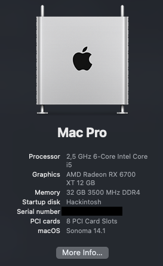

# hackintosh-z690-i512400f-rx6700xt

Install macOS Sonoma on Intel Z690 motherboard with Intel i5-1200F & RX 6700 XT.

---

### Information 

- MacOS: [Sonoma](https://www.apple.com/macos/sonoma/)
- Bootloader: [OpenCore 0.9.5](https://github.com/acidanthera/OpenCorePkg/releases/tag/0.9.5)
- The process took around a day with a lot of trouble shooting, the most prominent issue was the different OpenCore configurations in config.plist which was needed in order for this to work.

### Functionality
| Component    | Status |
|:---------:|:---:|
| Wifi      | ✅ |
| Bluetooth | ✅ |
| dGPU      | ✅ |
| NVME      | ✅ |
| DRM       | 🚫 |
| Ethernet  | ✅ |
| USB Wakeup| 🚫 |

### Hardware

| Component    | Variant                   | Link                                                                                                                                         |
|:------------:|:-------------------------:|:--------------------------------------------------------------------------------------------------------------------------------------------:|
| Mainboard    | MSI Z690-A Pro Wifi DDR4  | [MSI](https://www.msi.com/Motherboard/PRO-Z690-A-WIFI-DDR4)                                                                                  |
| Processor    | Intel Core i5 12400F      | [Intel i5 12400F](https://ark.intel.com/content/www/us/en/ark/products/134587/intel-core-i512400f-processor-18m-cache-up-to-4-40-ghz.html)   |
| Auido        | ALC897 / ALC892           |                                                                                                                                              |
| DDR4 RAM     | HyperX Fury Beast 32GB    | [Kingston](https://www.kingston.com/datasheets/KF436C16RB1A_16.pdf)                                                                          |
| NVMe SSD     | WD_Black SN770 NVME       | [WD_Black](https://www.westerndigital.com/products/internal-drives/wd-black-sn770-nvme-ssd?sku=WDS250G3X0E)                                  |
| Graphics     | AMD Radeon RX 6700XT      | [AMD Radeon RX 6700XT](https://www.amd.com/en/products/graphics/amd-radeon-rx-6700-xt)                                                       |
| WiFi / BT    | Intel® Wi-Fi 6E           | [Intel Wi-Fi 6E](https://www.intel.com/content/www/us/en/products/sku/130293/intel-wifi-6-ax201-gig/specifications.html)                     |
| Lan / Ethernet| Intel® I225-V            |                                                                                                                                              |

### Kexts

| Kext                                 | Function                             |
|:------------------------------------:|:------------------------------------:|
| AirpotItlwm.kext                     | Wifi Support                         |
| AppleALC.kext                        | Audio Support                        |
| BlueToolFixup.kext                   | Bluetooth Support                    |
| IntelBluetoothFirmware.kext          | Bluetooth Support                    |
| IntelBTPatcher.kext                  | Bluetooth Support                    |
| Lilu.kext                            | Required for OpenCore                |
| NootRX.kext                          | GPU Support (No DRM Content)         |
| NVMeFix.kext                         | NVME Fix                             |
| SMCProcessor.kext                    | Needed for Alder Lake CPUs           |
| SMCSuperIO.kext                      | Needed for Alder Lake CPUs           |
| USBToolBox.kext                      | USB Mapping                          |
| UTBMap.kext                          | USN Mapping                          |
| VirtualSMC.kext                      | Required for OpenCore                |
